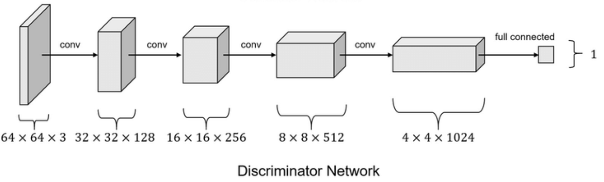
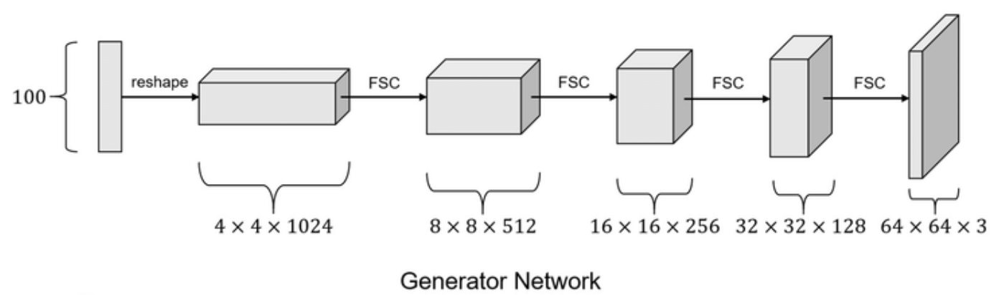

# DCGAN practice
Using the kaggle's open dataset to train a model that can generate hand image.

## Hand dataset
This dataset is come from this website
[Kaggle hand-palm-competition](https://www.kaggle.com/datasets/shyambhu/hands-and-palm-images-dataset)

## Discriminator

## Generator

