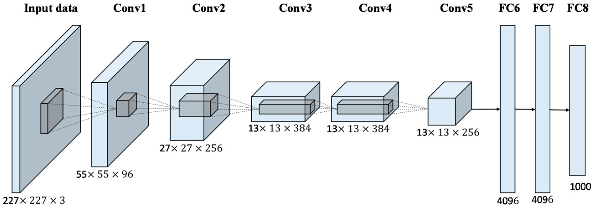

# MAML with pytorch
Impelement MAML with pytorch
[arxiv paper](https://arxiv.org/abs/1703.03400)

## Run training
``` bash
python model/model.py
```

## Run Testing
``` bash
python model/test.py
```

## Task model using AlexNet


## Reference
Github
1. https://github.com/Pulkit-Khandelwal/mldg
2. https://github.com/dragen1860/MAML-Pytorch

Docs
1. https://blog.csdn.net/wangkaidehao/article/details/105507809