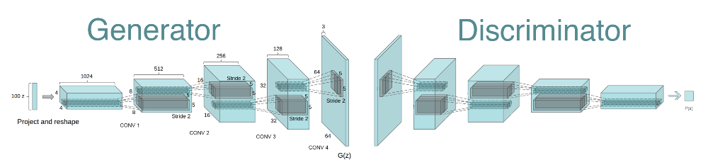
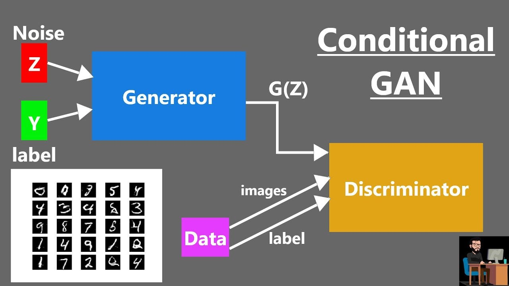

# GAN practice
For GAN practice only

## Hand GAN
Using DCGAN to generate the Hand image

## Mnist GAN
Using traditional GAN to generate MNIST image

## ConditionalGAN
Using conditionalGAN to generate MNIST image
